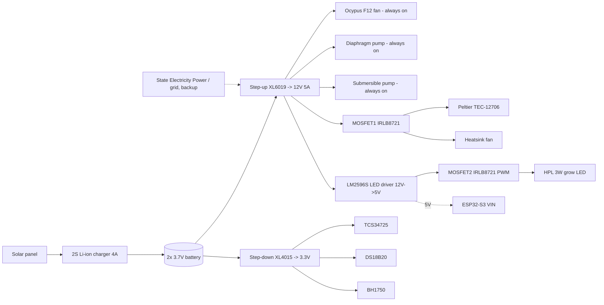

# Algae Air Purifier — ESP32-S3 firmware & wiring guide

Air path: MERV filter U25 → activated carbon (1000 iodine) → Ocypus Gamma F12 intake fan → diaphragm pump (micro-bubble diffuser) → algae chamber (mini submersible pump circulates water) → ~27% headspace releases O₂.

The ESP32-S3 doesn't touch the air path, it watches the algae (color, temperature, light) and runs the cooling loop, the grow light, and the dashboard also notifications.

## 1. Bill of materials

| Ref | Part | Where | Why |
|---|---|---|---|
| R1 | 4.7 kΩ resistor | DS18B20 DATA → 3.3V | OneWire is open-drain; without this pull-up the sensor can't pull the line high and reads garbage/-127°C. |
| R2 | 220 Ω resistor | GPIO5 → MOSFET1 gate | Limits inrush current into the gate capacitance; protects the GPIO pin. |
| R3 | 10 kΩ resistor | MOSFET1 gate → GND | Pull-down so the MOSFET is guaranteed OFF while the ESP32 is booting/resetting and the GPIO is floating. Without this, the peltier/fan can glitch on for a moment at every power-up. |
| R4 | 220 Ω resistor | GPIO6 → MOSFET2 gate | Same reason as R2, for the LED MOSFET. |
| R5 | 10 kΩ resistor | MOSFET2 gate → GND | Same reason as R3, for the LED MOSFET (keeps the grow light off during boot). |
| D1 | 1N4007 (or SS34 Schottky) | Across heatsink fan +/- | Flyback diode — the fan is a small inductive DC motor; without a return path for its collapsing field current, every OFF transition puts a voltage spike on MOSFET1's drain. |
| D2, D3, D4 | 1N4007 (optional but recommended) | Across ocypus fan, diaphragm pump, submersible pump | These are wired directly to the rail with no MOSFET, but they're still brushed/BLDC motors — a diode across each protects the 12V rail from switch-on/off spikes when the whole system powers up or a fuse/switch is toggled. |

If your TCS34725 / BH1750 breakout boards are bare chips rather than Adafruit/GY-style modules, also add two 4.7 kΩ pull-ups from SDA and SCL to 3.3V. Almost every breakout board already has these onboard, check before adding a second set, since doubled-up pull-ups just waste a little current, but confirm rather than assume.

## 2. Power architecture

**Priority is physical, not firmware-controlled** : wire the solar panel into the charger's input, the charger's battery output into the XL6019 & XL4015 inputs, and the grid/State Electricity Company supply into the same 12V bus through a diode or manually switched backup input. That priority comes from how you wire the supplies together (e.g. a diode-OR or a physical/automatic transfer switch on the 12V bus) — it isn't something the ESP32-S3 arbitrates in software.

Tie **all grounds together** : battery/12V rail GND, 5V rail GND, 3.3V rail GND, ESP32-S3 GND, and both MOSFET sources. If the ESP32-S3 and the sensors don't share a ground reference with the loads, the MOSFET gate signal has no reliable 0V reference and behaves erratically.

Power the ESP32-S3 board itself from the LM2596S's 5V/3A output (into its `5V`/`VIN` pin), it has plenty of headroom left over for the ~0.6A LED plus the ESP32-S3's ~500mA peak. Don't back power it from the XL4015 3.3V rail unless your specific ESP32-S3 board exposes a raw `3V3` pin meant for external supply (most do; check your board's pinout before relying on it).

## 3. MOSFET1 : Peltier + heatsink fan, ONE MOSFET, wired to switch together

Wire the peltier and the heatsink fan **in parallel**, both between the shared drain node and the 12V rail, so one gate signal switches both:

| From | To |
|---|---|
| 12V rail (+) | Peltier TEC-12706 (+) |
| 12V rail (+) | Heatsink fan (+) |
| Peltier (−) | MOSFET1 Drain |
| Heatsink fan (−) | MOSFET1 Drain |
| D1 cathode (banded end) | 12V rail (+) |
| D1 anode | MOSFET1 Drain |
| MOSFET1 Source | Common GND |
| MOSFET1 Gate | R2 (220 Ω) → ESP32-S3 GPIO5 |
| MOSFET1 Gate | R3 (10 kΩ) → Common GND (pull-down) |

Notes:
- IRLB8721 is a **logic-level** MOSFET (fully on around 4.5V Vgs), so driving it straight from a 3.3V GPIO (through R2) is fine, no gate driver IC needed.
- The peltier alone can pull ~5A; make sure MOSFET1 has a small heatsink if it runs long stretches at that current, and use wire gauge rated for 5A+ on the drain/source path.

## 4. MOSFET2 : Grow LED brightness (PWM)

| From | To |
|---|---|
| LM2596S output (+) | HPL 3W LED (+) |
| HPL 3W LED (−) | MOSFET2 Drain |
| MOSFET2 Source | Common GND |
| MOSFET2 Gate | R4 (220 Ω) → ESP32-S3 GPIO6 |
| MOSFET2 Gate | R5 (10 kΩ) → Common GND (pull-down) |

## 5. Sensors

| Sensor | Pin | ESP32-S3 pin | Notes |
|---|---|---|---|
| TCS34725 | VIN | 3.3V (from XL4015) | |
| | GND | Common GND | |
| | SDA | GPIO8 | shared I2C bus |
| | SCL | GPIO9 | shared I2C bus |
| BH1750 | VCC | 3.3V (from XL4015) | |
| | GND | Common GND | |
| | SDA | GPIO8 | same bus as TCS34725 (different I2C address, no conflict) |
| | SCL | GPIO9 | |
| DS18B20 | VCC (red) | 3.3V (from XL4015) | |
| | GND (black) | Common GND | |
| | DATA (yellow) | GPIO4 | **needs R1, 4.7 kΩ, DATA→3.3V** |

## 6. Always-on motors 

Ocypus Gamma F12 fan, diaphragm pump, and mini submersible pump are wired **straight to the 12V rail** with no ESP32 control.

## 7. Firmware setup

1. Open this folder in VS Code with the PlatformIO extension installed.
2. Edit `include/config.h`:
   - `WIFI_SSID` / `WIFI_PASSWORD`
   - `TELEGRAM_BOT_TOKEN` / `TELEGRAM_CHAT_ID` (see below)
   - Tune `ALGAE_GREEN_RATIO_MIN` / `ALGAE_SATURATION_MIN` / `DAYLIGHT_LUX_THRESHOLD` after a few days of real sensor logging (print raw values to Serial first).
3. **Upload the filesystem first** (PlatformIO sidebar → project tasks → your env → Platform → "Upload Filesystem Image"), so `data/index.html`, `style.css`, `script.js` land on LittleFS.
4. Then build & upload the firmware normally (Upload button / `pio run --target upload`).
5. Open the Serial Monitor at 115200 baud to see the assigned IP address, then browse to `http://<that-ip>/` from any device on the same network for the live dashboard.

### Telegram bot setup (phone notifications)
1. Message **@BotFather** on Telegram → `/newbot` → copy the token into `TELEGRAM_BOT_TOKEN`.
2. Message **@userinfobot** to get your numeric chat ID → put it in `TELEGRAM_CHAT_ID`.
3. Send your new bot any message once (Telegram requires the user to message the bot first before it can message back).
4. Reflash; you'll get a message the first time the algae turns pale, and weekly when nutrients are due.

The website also asks the browser for notification permission and will pop an in-browser notification for the same two events whenever the dashboard tab is open — Telegram is the one that reaches your phone even when the site is closed.
